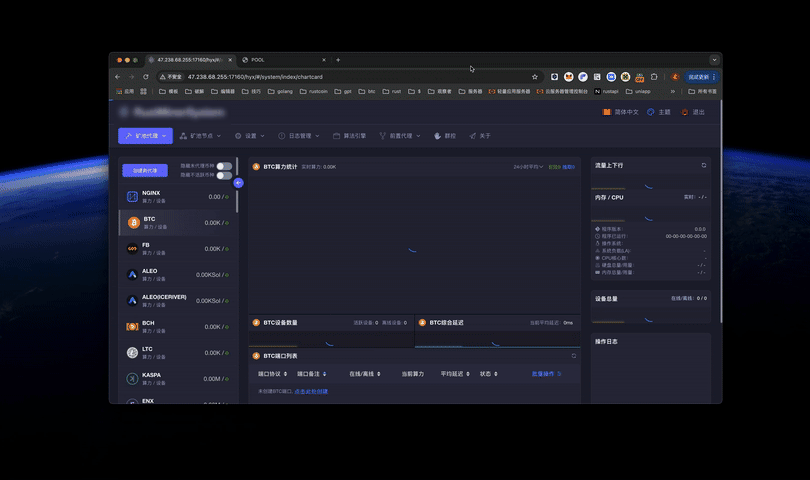

<div align="center">


<h3>面向矿机、矿场与矿池节点的全链路运维解决方案</h3>

<p>矿池中转 · 算力管理 · 自建矿池节点 · 加密压缩传输 · Web 可视化运维</p>

<p>
  <a href="https://github.com/mine-Proxy/TCMinerSystem/tree/main/Readme/i18n/zh-EN">English</a>
  ·
  <a href="https://github.com/mine-Proxy/TCMinerSystem">简体中文</a>
  ·
  <a href="https://github.com/mine-Proxy/TCMinerSystem/tree/main/Readme/i18n/zh-RU">Русский язык</a>
</p>

<p>
  <a href="https://github.com/mine-Proxy/TCMinerSystem/releases">
    
  </a>
  <a href="LICENSE">
    
  </a>
  <a href="https://t.me/TcstMinerSystem">
    
  </a>
  <a href="https://github.com/mine-Proxy/TCMinerSystem">
    
  </a>
</p>

<p>
  <a href="https://tcminersystem.gitbook.io/tcminersystem/chuan-tong-kuang-chi-dai-li/dai-li-chuan-tong-kuang-chi">矿池代理</a>
  ·
  <a href="https://tcminersystem.gitbook.io/tcminersystem/zi-jian-kuang-chi-jie-dian/cheng-wei-kuang-chi-jie-dian">自建矿池</a>
  ·
  <a href="https://github.com/mine-Proxy/RMS">RMS 加密压缩</a>
  ·
  <a href="https://tcminersystem.gitbook.io/tcminersystem">完整文档</a>
  ·
  <a href="https://tcminersystem.gitbook.io/tcminersystem/guan-yu/lian-xi-wo-men">联系与定制</a>
  ·
  <a href="https://tcminersystem.gitbook.io/tcminersystem/guan-yu/fu-wu-xie-yi">服务协议</a>
</p>



</div>

## TCMinerSystem 是什么

TCMinerSystem 是面向矿机、矿场和矿池节点的矿池代理与运维管理系统，可用于接入传统矿池、集中管理转发端口，也可根据业务需要搭建自有矿池节点。

配套的本地安全客户端 [RMS](https://github.com/mine-Proxy/RMS) 支持加密与压缩传输，可减少公网连接和带宽压力，并提升链路安全性。开始使用前，请先阅读 [服务协议](https://tcminersystem.gitbook.io/tcminersystem/guan-yu/fu-wu-xie-yi)。

## 核心能力

| 能力 | 说明 |
| --- | --- |
| 传统矿池代理 | 集中管理矿机连接、转发端口与目标矿池，简化批量设备接入和日常运维。 |
| 私有矿池节点 | 支持按业务需要搭建自有矿池节点，适用于矿场、节点服务商及自有算力场景。 |
| 算力与费率管理 | 提供算力统计、分配规则与自定义费率配置，便于观察和管理业务运行情况。 |
| RMS 安全传输 | 通过配套客户端完成加密与压缩传输，降低带宽压力并减少链路暴露。 |
| 多平台部署 | 提供 Linux 与 Windows 可执行程序及 Linux 安装工具，便于快速部署和更新。 |
| Web 管理后台 | 通过浏览器查看设备、端口、算力、日志、版本及系统运行状态。 |

## 快速开始

> [!IMPORTANT]
> 默认后台账号为 `qzpm19kkx`，默认密码为 `xloqslz913`。首次登录后请立即修改账号、密码和 Web 访问端口，并通过防火墙限制管理端口的访问来源。

### Linux

推荐使用 Ubuntu。在 Bash 终端中运行以下命令，打开安装工具菜单：

```sh
bash <(curl -s -L https://github.com/mine-Proxy/TCMinerSystem/raw/main/install.sh)
```

如果所在地区访问 GitHub 较慢，可尝试备用安装地址：

```sh
bash <(curl -s -L https://proxy.tcminersystem.com/install.sh)
```

安装工具启动后，根据菜单提示完成安装、更新、启动、停止和端口配置等操作。

<p align="center">
  
</p>

### Windows

1. 打开项目的 [windows 目录](https://github.com/mine-Proxy/TCMinerSystem/tree/main/windows)。
2. 选择最新版本的 `tcstminersystem-*.exe` 文件。
3. 进入文件页面，点击 `View raw` 下载程序。
4. 双击运行，并根据终端提示在浏览器中打开管理后台。
5. 首次登录后立即修改默认账号、密码与 Web 访问端口。

## 文档导航

| 使用场景 | 文档入口 |
| --- | --- |
| 接入传统矿池 | [传统矿池代理教程](https://tcminersystem.gitbook.io/tcminersystem/chuan-tong-kuang-chi-dai-li/dai-li-chuan-tong-kuang-chi) |
| 搭建矿池节点 | [自建矿池节点教程](https://tcminersystem.gitbook.io/tcminersystem/zi-jian-kuang-chi-jie-dian/cheng-wei-kuang-chi-jie-dian) |
| 使用加密压缩客户端 | [RMS 项目](https://github.com/mine-Proxy/RMS) |
| 查看完整使用说明 | [TCMinerSystem 文档中心](https://tcminersystem.gitbook.io/tcminersystem) |
| 获取新版本 | [Releases](https://github.com/mine-Proxy/TCMinerSystem/releases) |
| 联系与定制 | [联系我们](https://tcminersystem.gitbook.io/tcminersystem/guan-yu/lian-xi-wo-men) |
| 阅读服务条款 | [服务协议](https://tcminersystem.gitbook.io/tcminersystem/guan-yu/fu-wu-xie-yi) |

## 支持范围

TCMinerSystem 的算法与币种支持会随版本更新。以下为项目文档中列出的常见示例，实际支持范围请以当前版本后台及官方文档为准。

<details>
<summary>展开查看常见算法与币种</summary>

| 算法 | 常见币种 |
| --- | --- |
| SHA256 | BTC、BCH 等 |
| ETHASH | ETC、ETHW、ETHF、ETC+ZIL、ETHW+ZIL、ETHF+ZIL 等 |
| SCRYPT | LTC 等 |
| KHEAVYHASH | KASPA 等 |

</details>

## 授权网络中的透明接入

如果你负责矿场运维，或已获得矿场路由器及相关设备的管理授权，可联系项目方评估 DNS 或透明代理接入方案，以减少逐台修改矿机配置的工作量。

> [!WARNING]
> 透明接入仅限设备所有者明确知情并授权的网络环境。请勿对不属于你或未经授权的设备、算力和网络流量进行劫持、转发或分流。

## 社区与支持

欢迎通过以下渠道获取版本更新、交流使用问题或咨询定制服务：

<p>
  <a href="https://t.me/TcstMinerSystem">
    
  </a>
  <a href="https://qm.qq.com/cgi-bin/qm/qr?k=O22gwKOK0v3JqVtOjwWzmK6H3Qd0h2Ty&amp;jump_from=webapi&amp;authKey=0FwwAgxRzswAFCgpiEKafzcgOgj8Uzm8DDzriyx7omj5MqPCQOAS/qQw3tXX6hrq">
    
  </a>
  <a href="https://github.com/mine-Proxy/TCMinerSystem/releases">
    
  </a>
</p>

## 特别感谢

感谢以下矿池在一定范围内提供技术支持：

<table>
  <tr>
    <td align="center" width="160">
      
    </td>
    <td align="center" width="160">
      
    </td>
    <td align="center" width="160">
      
    </td>
    <td align="center" width="160">
      
    </td>
  </tr>
</table>

## 服务协议

> [!CAUTION]
> TCMinerSystem 受香港法律监管。不同国家或地区可能对数字货币、矿机管理与矿池服务作出不同限制；使用前请确认相关活动在你所在地区合法合规。

<details>
<summary>展开查看合规说明</summary>

### 产品性质

- 本产品定位为矿机、矿场和矿池节点运维管理工具，不属于 VPN 工具，也不提供绕过网络访问限制的能力。
- 所有接入设备均应由设备所有者或获得明确授权的管理者主动配置；不得以不正当方式获取、控制或分流他人的设备、数据与算力。

### 用户准入

使用本服务即表示你确认：

1. 不属于联合国安理会等机构列明的恐怖组织或恐怖活动人员；
2. 未被相关国家或地区的行政、司法或执法机构限制或禁止使用本程序；
3. 不属于古巴、伊朗、朝鲜、叙利亚及其他受到适用制裁的国家或地区居民；
4. 不属于法律或政策禁止开展数字货币相关活动的国家或地区居民；
5. 使用本程序及其全部功能符合所在地法律、法规和政策要求。

### 责任说明

你有责任理解并遵守所在地适用法律。因所在地法律、政策或其他适用规则导致使用本服务违法的，相关风险和责任由使用者自行承担。下载或运行本软件，即视为已阅读并同意项目的完整服务协议。

完整条款请参阅 [TCMinerSystem 服务协议](https://tcminersystem.gitbook.io/tcminersystem/guan-yu/fu-wu-xie-yi)。

</details>

## License

本项目基于 [MIT License](LICENSE) 发布。
